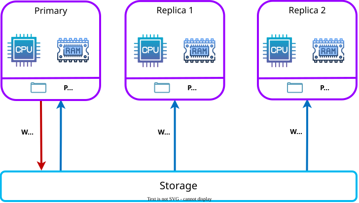

<div align="center">

# Awide Polar

**An open-source cloud-native database based on PostgreSQL**

[](https://awide.tech/awidepolar)

[](./LICENSE)
[](https://github.com/awide-labs/polar/issues)
[](https://github.com/awide-labs/polar/pulls)
[](https://github.com/awide-labs/polar/network/members)
[](https://github.com/awide-labs/polar/stargazers)
[](https://github.com/awide-labs/polar/graphs/contributors)

</div>

## Overview



Awide Polar is a cloud-native database based on [PolarDB for PostgreSQL](https://github.com/polardb/PolarDB-for-PostgreSQL) by Alibaba Cloud. It is fully compatible with PostgreSQL and uses a shared-storage-based architecture in which computing is decoupled from storage. Awide Polar features flexible scalability, millisecond-level latency, and hybrid transactional/analytical processing (HTAP) capabilities.

1. Flexible scalability: You can scale out a compute cluster or a storage cluster based on your business requirements.
   - If the computing power is insufficient, you can scale out only the compute cluster.
   - If the storage capacity or the storage I/O is insufficient, you can scale out a storage cluster without interrupting your service.
2. Millisecond-level latency:
   - Write-ahead logging (WAL) logs are stored in the shared storage. Only the metadata of WAL records is replicated from the read-write node to read-only nodes.
   - The _LogIndex_ technology features two record replay modes: lazy replay and parallel replay. The technology can be used to minimize the record replication latency from the read-write node to read-only nodes.
3. HTAP: HTAP is implemented by using a shared-storage-based massively parallel processing (MPP) architecture. The architecture is used to accelerate online analytical processing (OLAP) queries in online transaction processing (OLTP) scenarios. Awide Polar supports a complete suite of data types that are used in OLTP scenarios and two computing engines that can process these types of data:
   - Standalone execution: processes OLTP queries that feature high concurrency.
   - Distributed execution: processes large OLAP queries.

Awide Polar provides a wide range of innovative multi-model database capabilities to help you process, analyze, and search for different types of data, such as spatio-temporal, geographic information system (GIS), image, vector, and graph data.

## Branch Introduction

The `POLARDB_15_STABLE` branch is the stable branch based on PostgreSQL 15, which supports the compute-storage separation architecture.

## Architecture and Roadmap

Awide Polar uses a shared-storage-based architecture in which computing is decoupled from storage. The conventional shared-nothing architecture is changed to the shared-storage architecture. N copies of data in the compute cluster and N copies of data in the storage cluster are changed to N copies of data in the compute cluster and one copy of data in the storage cluster. The shared storage stores one copy of data, but the data states in memory are different. The WAL logs must be synchronized from the primary node to read-only nodes to ensure data consistency. In addition, when the primary node flushes dirty pages, it must be controlled to prevent the read-only nodes from reading future pages. Meanwhile, the read-only nodes must be prevented from reading the outdated pages that are not correctly replayed in memory. To resolve this issue, Awide Polar provides the index structure _LogIndex_ to maintain the page replay history. LogIndex can be used to synchronize data from the primary node to read-only nodes.

After computing is decoupled from storage, the I/O latency and throughput increase. When a single read-only node is used to process analytical queries, the CPUs, memory, and I/O of other read-only nodes and the large storage I/O bandwidth cannot be fully utilized. To resolve this issue, Awide Polar provides the shared-storage-based MPP engine. The engine can use CPUs to accelerate analytical queries at SQL level and support a mix of OLAP workloads and OLTP workloads for HTAP.

For more information, see [Architecture](polar-doc/docs/theory/arch-overview.md).

## Quick Start

If you have Docker installed, you can pull the Awide Polar local instance image, create and run a container, and connect directly:

```bash
# pull the instance image and run the container
docker pull awide-labs/awide-polar-local:15
docker run -it --cap-add=SYS_PTRACE --privileged=true --rm awide-labs/awide-polar-local:15 psql
# check
postgres=# SELECT version();
                                   version
----------------------------------------------------------------------
 PostgreSQL 15.x (Awide Polar 15.x.x.x build xxxxxxxx) on {your_platform}
(1 row)
```

For deployment and product information, see the [Awide Polar website](https://awide.tech/awidepolar).

## Development

See [CONTRIBUTING.md](CONTRIBUTING.md) and the [kernel contribution guide](polar-doc/docs/contributing/contributing-polardb-kernel.md) to compile and develop Awide Polar.

## Documentation

Documentation lives in [`polar-doc/docs/`](polar-doc/docs/). Run `pnpm run docs:dev` from `polar-doc/` to preview locally.

## Contributing

We welcome contributions! Please see [CONTRIBUTING.md](CONTRIBUTING.md) for guidelines on how to contribute to this project.

Here are the contributors:

<a href="https://github.com/awide-labs/polar/graphs/contributors">
  
</a>

Made with [contrib.rocks](https://contrib.rocks).

## Star History

[](https://star-history.com/#awide-labs/polar&Date)

## Software License

Awide Polar is released under the [GNU Affero General Public License v3.0](https://www.gnu.org/licenses/agpl-3.0.html) (AGPLv3). See [LICENSE](./LICENSE) for the full license text.

This project is developed from [PolarDB for PostgreSQL](https://github.com/polardb/PolarDB-for-PostgreSQL) by Alibaba Cloud, which is licensed under the Apache License 2.0, and from PostgreSQL, which is licensed under the PostgreSQL License. Portions of the codebase retain those upstream licenses as described in [NOTICE](./NOTICE). Awide Polar also contains various third-party components under other open source licenses; see [NOTICE](./NOTICE) for details.

## Copyright

Copyright © Awide Labs
